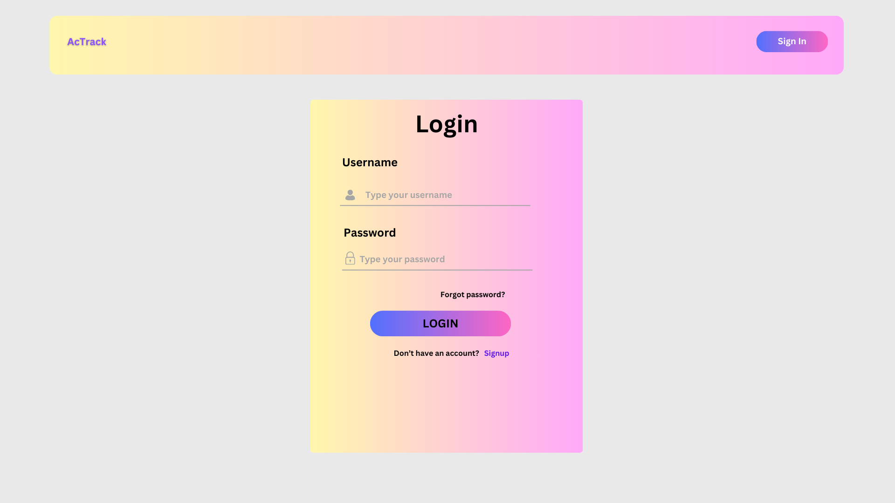
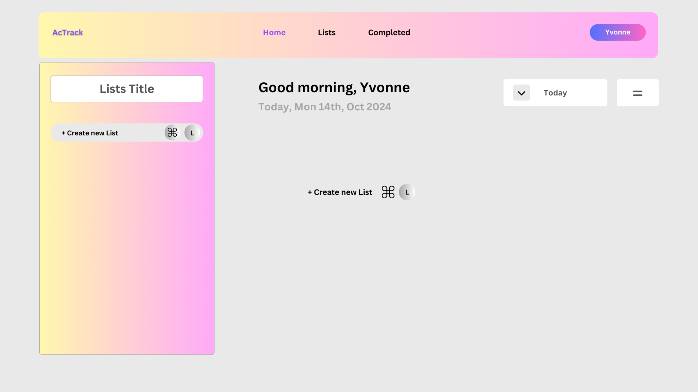
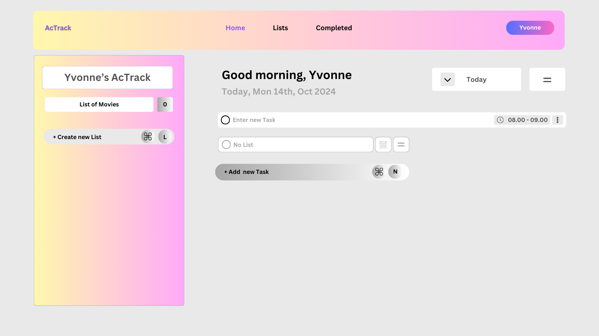
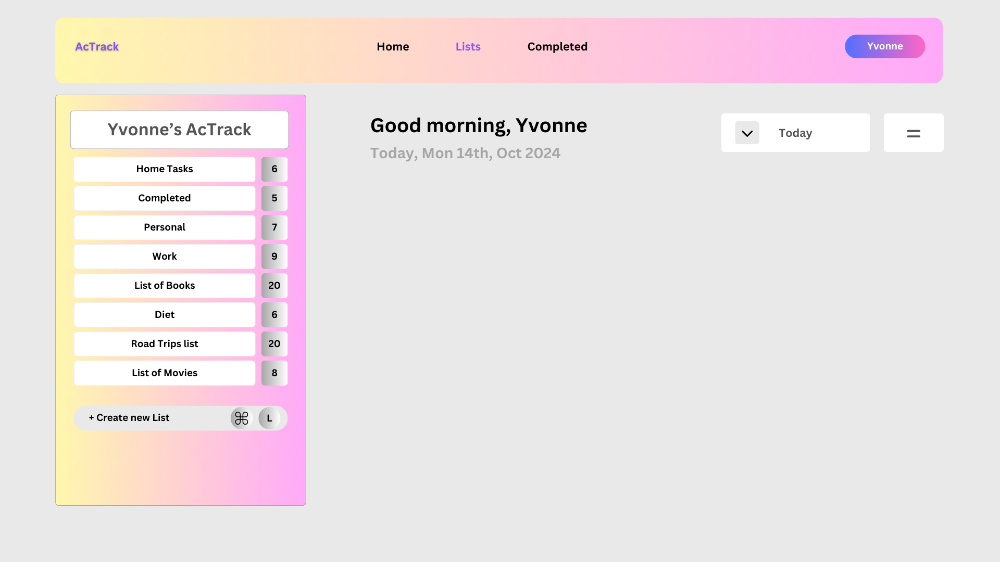
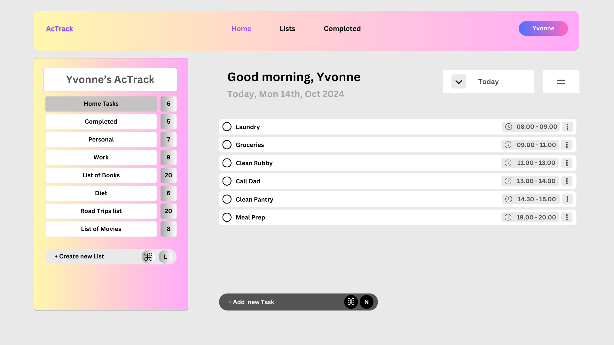
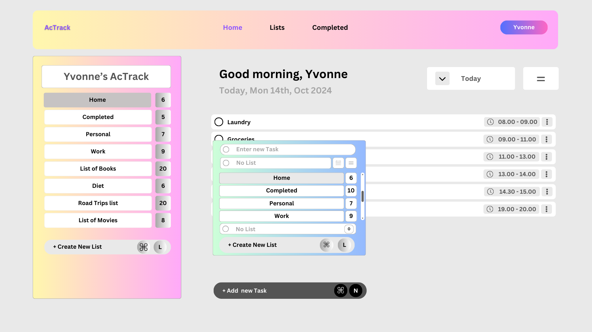
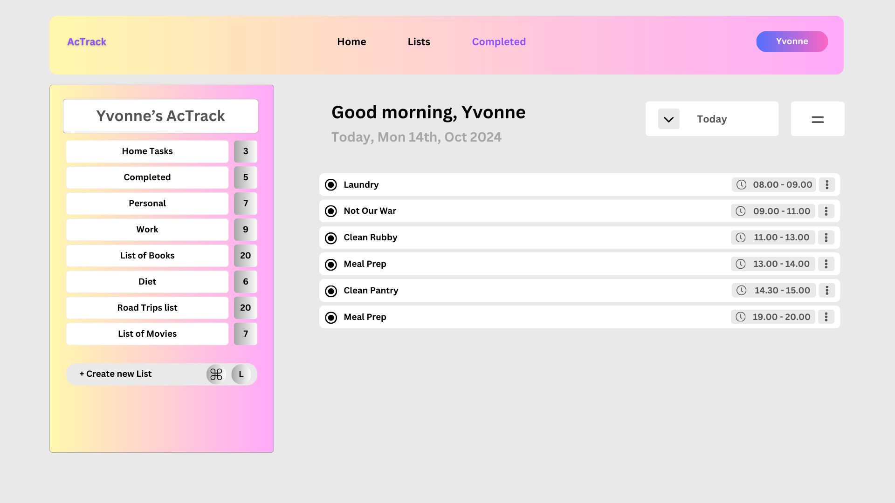

# Project Title

 ### *AcTrack*

## Overview

The To-Do Web App is a task management tool that allows users to create, manage, and organize their short and long term tasks efficiently. It provides a user-friendly interface to help users prioritize their daily activities and improve productivity.

### Problem Space

In today's fast-paced world, individuals often struggle to keep track of their tasks and responsibilities. Traditional methods such as pen and paper are prone to being lost or forgotten. This app addresses the need for a reliable digital solution that helps users stay organized, reduces stress, and enhances time management as well as reduce procrastination habits.


### User Profile

- The primary users of this app are professionals, students, family, friends and anyone looking to manage their tasks more effectively. Users will interact with the app through a web interface where they can add, delete, and edit tasks. Special considerations include ensuring accessibility for users with disabilities and providing a responsive design for use on various devices.

### Features

List the functionality that your app will include. These can be written as user stories or descriptions with related details. Do not describe _how_ these features are implemented, only _what_ needs to be implemented.

- **_User Authentication:_** Users can sign up, log in, and manage their accounts.
- **_Task Creation:_** Users can add new tasks with details such as task title and due date.
- **_Task Editing:_** Users can edit existing tasks to update details or change statuses.
- **_Task Deletion:_** Users can remove tasks they no longer need from the lists.
- **_Task Organization:_** Users can categorize tasks by priority or status (active and completed).
- **_Sorting:_** Users can sort tasks based on alphabettical order and sort them by due date or priority.
- **_Notifications:_** Users receive reminders for upcoming tasks.
- **_Data Persistence:_** All tasks are saved in a database to ensure they are accessible across sessions.


## Implementation

### Tech Stack

List technologies that will be used in your app, including any libraries to save time or provide more functionality. Be sure to research any potential limitations.

- **_Frontend:_** React, HTML, CSS, Sass
    - Frontend Libraries:
        - react
        - react-router
        - axios
- **_Backend:_** Node.js, Express
    - Backend Libraries:
        - Knex
        - Express
- **_Database:_** MySQL
- **_State Management:_** React Hooks
- **_API:_** Axios for making HTTP requests

### APIs

- **_Task Management API:_** For CRUD operations on tasks.
- **_Authentication API:_** For user sign-up and login processes.


### Sitemap

- **_Login/Signup:_** User authentication pages.


- **_Task Dashboard_** Main interface for managing tasks.  
  

- **_Settings_** User account settings.  


- **_Task Details_** Detailed view for individual tasks.  
  

- **_Home_** Overview of scheduled tasks.  
  


- **_Edit_** Overview of scheduled with edit options to change time or move to a different list.  
  

  - **_Completed Tasks_** Detailed view for complted individual tasks from all lists.  
  


### Mockups
My page is divides into: 

#### _Log In Page_
#### _Home Page_
#### _Lists Page_
#### _Completed Page_

- You can View the Mockups here:

[https://www.canva.com/design/DAGTqL10FMY/nZtZTZb4ehgqyXo4DjEPJA/view?utm_content=DAGTqL10FMY&utm_campaign=share_your_design&utm_medium=link&utm_source=shareyourdesignpanel]

### Data

**_Users:_** 

- Each user has the following properties:
    - id: A unique identifier for the user.
    - username: The name the user goes by within the application.
    - email: The user's email, used for authentication.
    - password: A hashed version of the user's password for account security.
- _Relationship:_ A user can have multiple tasks associated with them.

**_Tasks:_**

- Each task has the following properties:
    - id: A unique identifier for the task.
    - title: The name or description of the task.
    - due_time: The time by which the task should be completed.
    - priority: The importance level of the task (high, medium, low).
    - status: The current state of the task (e.g., active, completed).
    - user_id: A reference to the user who created the task (foreign key to Users table).
- _Relationship:_ Each task is associated with one user, but a user can have many tasks.


**_Relationships_**

_One-to-Many Relationship:_

A user can have many tasks.
This means that for every user in the system, there can be several tasks associated with that user.

### Endpoints

List endpoints that your server will implement, including HTTP methods, parameters, and example responses.

**_POST /login:_** Allows a user to log in.

Request Body:
```
{
  "email": "user@example.com",
  "password": "password123"
}
```

Response:

```
{
  "message": "Login successful",
  "token": "eyJhbGciOiJIUzI1NiIsInR5cCI6IkpXVCJ9...",
  "user": {
    "id": 1,
    "username": "yvonne_itan",
    "email": "user@example.com"
  }
}
```


**_POST /signup:_** Allows a new user to create an account.
Request Body:
```
{
  "username": "yvonne_itan",
  "email": "user@example.com",
  "password": "password123"
}
```

Response:
```
{
  "message": "Account created successfully",
  "user": {
    "id": 1,
    "username": "yvonne_itan",
    "email": "user@example.com"
  }
}

```
**_GET /tasks:_** Fetches all tasks for a logged-in user.

Response:
```
[
  {
    "id": 101,
    "title": "Buy groceries",
    "due_date": "2024-10-20",
    "priority": "high",
    "status": "active",
    "user_id": 1
  },
  {
    "id": 102,
    "title": "Finish project report",
    "due_date": "2024-10-25",
    "priority": "medium",
    "status": "active",
    "user_id": 1
  }
]
```
**_POST /tasks:_** Creates a new task.


Request body:
```
{
  "title": "Groceries",
  "due_time_from": "09:00",  
  "due_time_to": "11:00",  
  "priority": "High",
  "status": "active"
}
```
Response:
```
{
  "message": "Task created successfully",
  "task": {
    "id": 103,
    "title": "Groceries",
    "due_time_from": "09:00",
    "due_time_to": "11:00",
    "priority": "High",
    "status": "active",
    "user_id": 1
  }
}
```
**_PUT /tasks/:id:_** Edits an existing task by its ID.

Request body:
```
{
  "title": "Clean pantry",
  "due_time_from": "14:30",  
  "due_time_to": "15:00",   
  "priority": "medium",
  "status": "active"
}
```
Response:
```
{
  "message": "Task updated successfully",
  "task": {
    "id": 103,
    "title": "Clean Pantry",
    "due_time_from": "12:30",
    "due_time_to": "13:30",
    "priority": "medium",
    "status": "active",
    "user_id": 1
  }
}
```
**_DELETE /tasks/:id:_** Deletes a task by its ID.

Resposense:
```
{
  "message": "Task deleted successfully"
}
```

## Roadmap

Scope your project as a sprint. Break down the tasks that will need to be completed and map out timeframes for implementation working back from the capstone due date. 


- Week 1: Project Setup and Core Functionality
    ```
    - Day 1-2: Project Setup
        - Create Client: Set up React project with routing and basic components.
        - Create Server: Set up Express project with basic routing and placeholder responses.
    ```
    
    ```
    - Day 3: Database Setup
        - Create Migrations: Define database migrations for users and tasks.
        - Gather Sample Data: Collect sample task details for testing.
        - Create Seeds: Populate the database with sample data.
    ```
    ```
    - Day 4-5: User Authentication
        - Implement Signup and Login Functionality:
        Create endpoints for user authentication (signup, login) and implement JWT for session management.
    ```
    ```
    - Day 6-7: Task Management Features
        - Task Creation and Deletion: Implement task creation and deletion endpoints.
        - Task Editing: Implement task editing functionality.
        - Data Persistence: Ensure all tasks are saved in the database and accessible across sessions.
    ```
- Week 2: Advanced Features, Testing, and Deployment
    ```
    - Day 8-9: Task Organization and Notifications
        - Implement Task Organization:
        Allow users to categorize and sort tasks based on priority and due date.
        - Implement Notifications:
        Set up a basic notification system for upcoming tasks.
    ```
    ```
    - Day 10: Testing
        - Conduct Unit and Integration Tests: Test all implemented features to ensure functionality and reliability.
    ```
    ```
    - Day 11-12: Final Adjustments
        - Bug Fixes: Address any bugs identified during testing.
        - UI Improvements: Enhance the user interface for a better experience.
    ```

    ```
    - Day 13-14: Deployment and Demo Preparation
        - Deploy Application: Deploy the client and server projects to a production environment (e.g., Heroku, Vercel).
        - Prepare for Demo: Create presentation materials and prepare for demonstration.
    ```
## Future Implementations
Your project will be marked based on what you committed to in the above document. Here, you can list any additional features you may complete after the MVP of your application is built, or if you have extra time before the Capstone due date.

